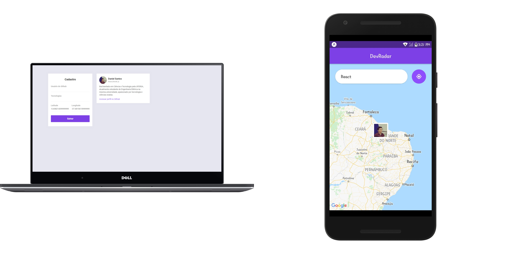

# DevRadar

Projeto criado durante minha participação na 10ª versão do workshop "Semana Omnistack" organizada pela @Rocketseat.
A aplicação consiste na localização geográfica de desenvolvedores próximos ao usuário por meio das tencologias 
que esses utilizam.

**:rocket: Tecnologias:**

- [Node JS](https://nodejs.org/en/)
- [React JS](https://pt-br.reactjs.org/)
- [React Native](https://facebook.github.io/react-native/)
- [Expo](https://expo.io/)
- [Mongo DB](https://www.mongodb.com/)

**:package: Bibliotecas:**
- [Express](https://expressjs.com/pt-br/)
- [React Navigation](https://reactnavigation.org/)
- [Mongoose](https://socket.io/)
- [Socket.IO](https://socket.io/)
- [Axios](https://github.com/axios/axios)

---

:coffee: Desenvolvido por Daniel Santos && <a href="https://github.com/Rocketseat">Rocketseat</a>

